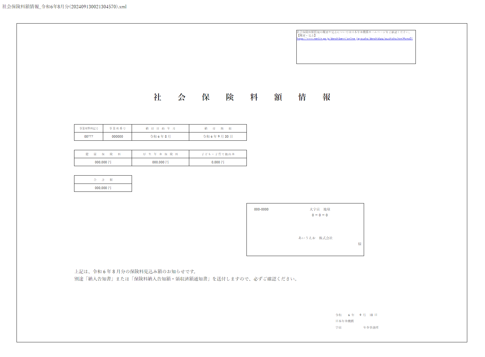

# xsl-viewer-html

HTML ファイルひとつで、電子公文書が入った XLS ファイル入りの ZIP ファイルを展開し表示します。

- 外部ライブラリ未使用板

https://sorakumo001.github.io/xsl-viewer-html/

- PDF変換機能板

https://sorakumo001.github.io/xsl-viewer-html/pdf

## 使い方

Chromium系のブラウザでZIPファイル、もしくは展開したファイルをまとめてドラッグドロップすると、以下のように表示されます

